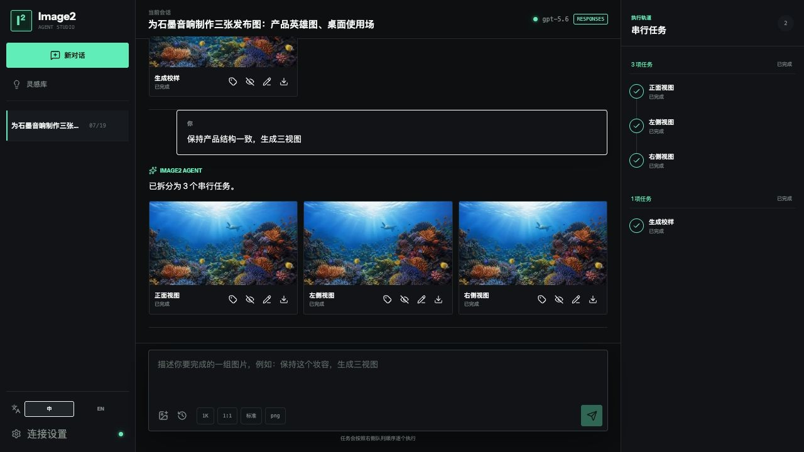
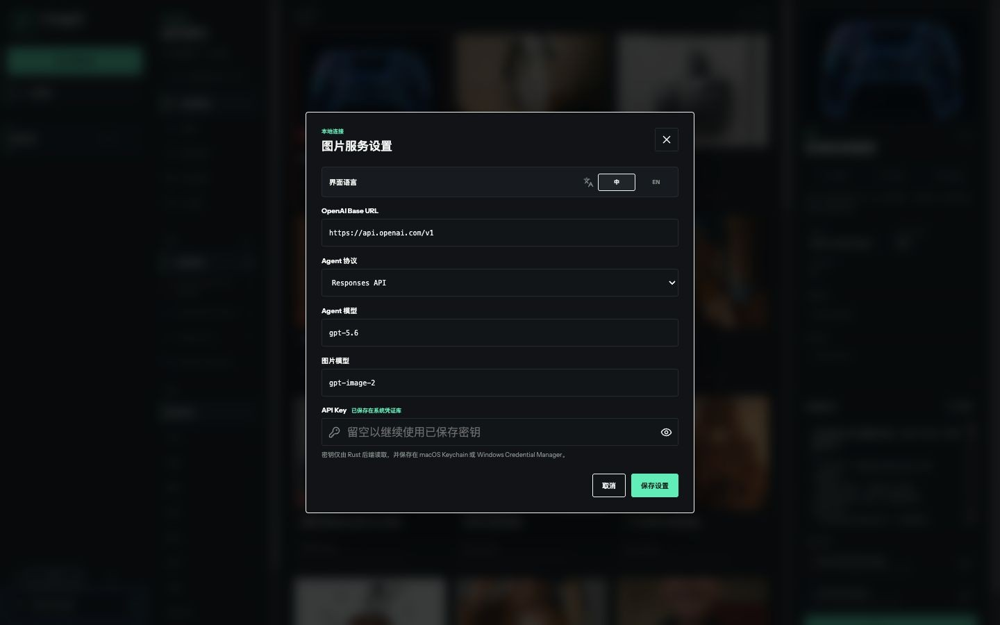
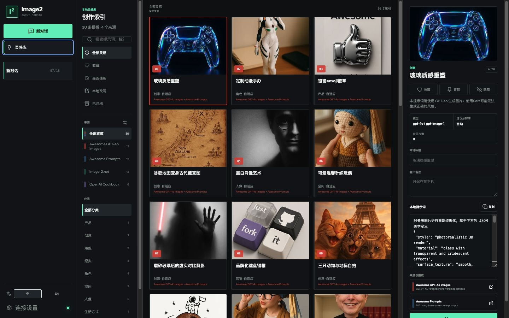
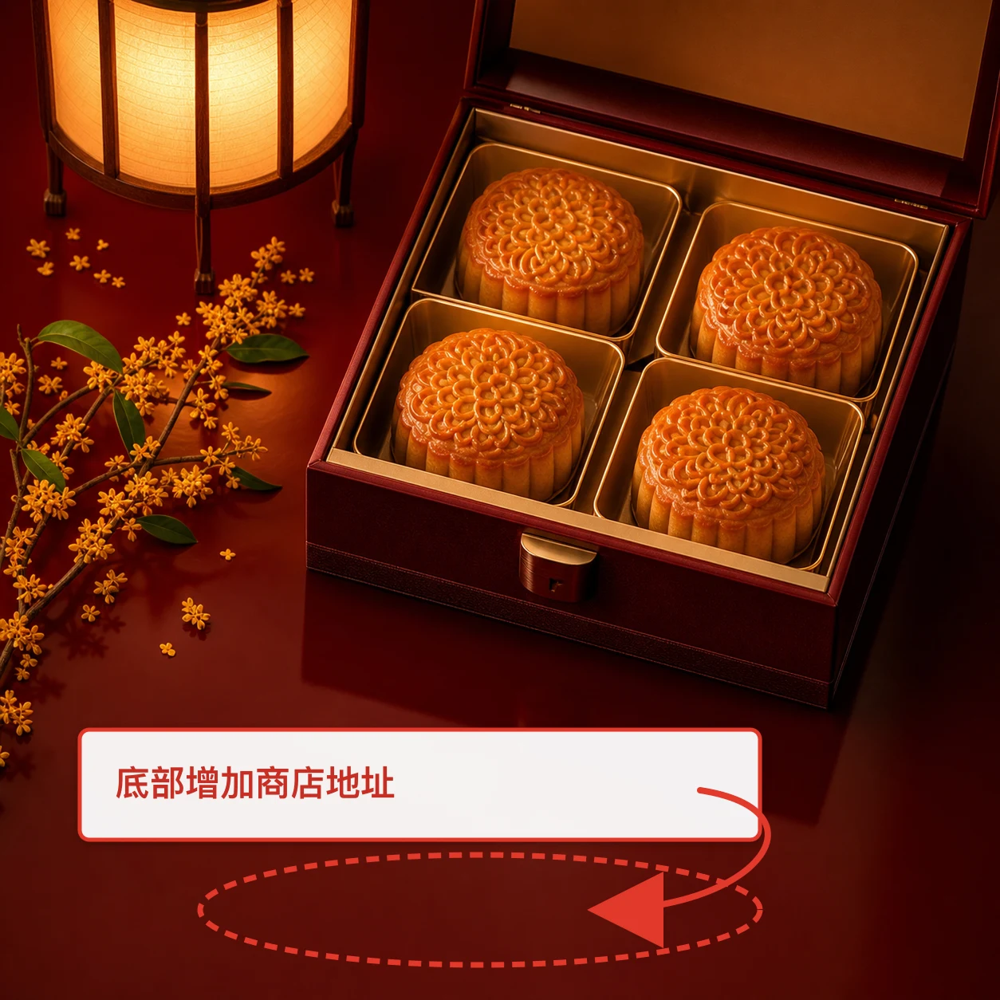

# Image2 Studio 操作手册

本文面向使用 Image2 Studio 完成图片生成、参考图融合和局部精准编辑的用户。界面截图基于当前桌面版；真实图片请求只在 Tauri 桌面端执行，浏览器开发模式仅用于界面预览和模拟 Agent。

## 1. 快速开始

### 1.1 启动应用

安装版直接启动 Image2 Studio。源码开发环境可执行：

```bash
npm install
npm run tauri:dev
```

主工作区分为三部分：左侧管理会话和灵感库，中间完成对话、附件与参数设置，右侧显示严格串行执行的任务队列。



### 1.2 配置图片服务

首次使用先点击左下角的“连接设置”。



依次填写：

| 字段 | 填写说明 |
| --- | --- |
| OpenAI Base URL | OpenAI 或兼容网关地址，通常以 `/v1` 结尾。远程地址必须使用 HTTPS；仅本机地址允许 HTTP。 |
| Agent 协议 | 网关支持 `/responses` 时选 Responses API；只支持 `/chat/completions` 时选 Chat Completions。 |
| Agent 模型 | 用于理解对话并拆分图片任务的模型。 |
| 图片模型 | 用于文生图和图片编辑的模型。 |
| API Key | 服务密钥。保存后输入框会清空，后续留空即可继续使用系统中已保存的密钥。 |

点击“保存设置”完成配置。API Key 只交给桌面端 Rust 后端，并存放在 macOS Keychain 或 Windows Credential Manager 中，不会写入对话、项目文件或 IndexedDB。

## 2. 创建图片任务

### 2.1 新建会话

1. 点击左上角“新对话”。
2. 在底部输入框描述最终目标，不必先手工拆成每一张图。
3. 需要参考图时点击图片图标，或直接把图片粘贴进输入框。
4. 需要复用历史结果时点击历史图标，从“历史素材”中选择图片。

推荐把目标、数量、必须保持的内容和输出用途写清楚。例如：

```text
保持人物五官、妆容和发型一致，生成正面、左侧 45 度、右侧 45 度三张棚拍头像。
统一使用浅灰背景和柔和轮廓光，不添加文字。
```

Agent 每批最多创建 8 个独立任务。任务会进入全局 FIFO 队列，并始终逐张生成，避免并发请求造成费用和结果顺序失控。

### 2.2 设置参考图角色

上传多张图后，展开每个附件的“主角色”菜单，为它指定用途和保持约束。

| 角色 | 适用内容 | 常见保持约束 |
| --- | --- | --- |
| 原图 | 本次编辑的基线图片 | 未标注区域、整体构图 |
| 人物 | 身份、五官、发型、妆容 | 人物身份、脸部比例 |
| 产品 | 商品结构、轮廓、比例 | 产品骨架、Logo 位置 |
| 动作 | 姿势、手势、视线方向 | 人物身份不跟随动作图 |
| 构图 | 草图、机位、元素布局 | 主体相对位置 |
| 材质 | 面料、金属、木纹等表面 | 产品结构不变 |
| 色卡 | 品牌色或配色参考 | 仅迁移颜色 |
| 风格 | 摄影、插画、光线和气质 | 不覆盖人物或产品身份 |
| 版式 | 海报层级、文字区和留白 | 文案层级、Logo 安全区 |

同一附件可以有多个角色，列表中的第一个角色是主角色。发生冲突时，应在提示词中明确优先级，例如：

```text
产品结构以 @Image001 为准；@Image002 只参考灯光、背景和排版，不改变产品比例与按键位置。
```

### 2.3 选择生成参数

发送前可设置：

| 参数 | 可选值 | 建议 |
| --- | --- | --- |
| 分辨率 | 1K、2K、4K | 草稿用 1K，确认构图后再提高。 |
| 比例 | 1:1、4:3、16:9、3:4、9:16 | 根据最终投放位置选择。 |
| 质量 | 草稿、标准、精细 | 精细通常更慢且费用更高。 |
| 格式 | PNG、JPEG、WebP | 需要无损后期优先 PNG，需要较小文件优先 WebP。 |

按 Enter 或点击发送按钮提交；Shift+Enter 用于换行。Agent 分析期间再次点击停止图标只会取消本次发送，不会创建图片任务。

### 2.4 查看和控制队列

右侧“串行任务”会显示批次和单项状态：等待中、生成中、已完成、失败、已停止或已中断。

- 点击批次上的停止图标可停止尚未完成的任务。
- 单项失败后点击“重试”，不会重新执行已经成功的其他任务。
- 应用异常退出或重启后，未完成任务会显示“已中断”；点击“恢复批次”后才会继续，应用不会自行产生费用。

## 3. 使用灵感库

点击左侧“灵感库”进入本地创作索引。目录可按关键词、来源、分类、收藏、最近使用、本地改写和归档状态筛选。



典型操作：

1. 在左上角搜索框输入主题、标签或作者。
2. 通过“来源”和“分类”缩小范围。
3. 点击卡片，在右侧查看模型建议、比例、完整提示词与来源授权。
4. 可收藏、置顶或隐藏模板，也可修改“本地标题”“客户备注”和“本地提示词”。
5. 点击“生成同款”，模板会带入当前对话，再补充主体、品牌和用途即可发送。

点击“来源”标题右侧的设置图标，可管理目录更新：

- 启用或停用某个来源，并单独检查更新。
- 设置每次启动、每天、每周或关闭自动更新。
- 选择“仅新增”或“新增并更新”。
- 选择浏览时加载或更新时下载缩略图。
- 将收藏、备注、改写和使用记录导出为 JSON/ZIP，或在另一台设备导入。

本地资料不会上传。某个远程来源更新失败时，已安装目录不会被删除。

## 4. 精准标注与局部编辑

### 4.1 进入 Draw 编辑器

以下入口都可以打开同一个精准编辑器：

- 悬停输入区附件，点击铅笔形 Draw 图标。
- 悬停生成结果，点击 Draw/标注图标。
- 打开大图预览，再点击顶部 Draw 图标。
- 在历史消息中的 Annotation 附件上再次点击 Draw，继续已有草稿。

标注只描述“改哪里”，右侧修改要求描述“怎么改”。打开、保存或“添加到对话”都不会调用图片 API；只有返回对话并发送任务后才会产生图片请求。

### 4.2 标注工具

| 工具 | 生成对象 | 用法 |
| --- | --- | --- |
| 选择 | 无 | 选择、移动或删除已有标注对象。 |
| 移动画布 | 无 | 拖动画布；滚轮缩放，左下角按钮可缩小、适应窗口或放大。 |
| 点选 Mark | `Mark01`、`Mark02`… | 在主体、商品或其他明确对象上建立定位点。 |
| 框选 Region | `Region01`、`Region02`… | 拖出矩形，指定背景、版面或规则区域。 |
| 画笔 Mask | `Mask01`、`Mask02`… | 涂画不规则区域，并可调整画笔宽度。 |
| 方向箭头 | `Move01`、`Move02`… | 从起点拖向终点，表达移动或指向关系。 |
| 文字备注 | `Note01`、`Note02`… | 在画布上增加可引用的文本说明。 |

工具栏还提供撤销、重做和删除。编号一旦创建便保持稳定；删除对象后不会把旧编号分配给新对象，以免历史提示词指错位置。

### 4.3 在提示词中引用标注

1. 创建至少一个 Mark、Region、Mask、Move 或 Note。
2. 在“修改要求”中输入 `@`，从菜单选择对象。
3. 点击提示词中的 Token 可反向定位画布对象。
4. 颜色可直接写为 Hex，例如 `#C59A3A`，界面会显示对应色块。
5. 检查无失效引用后点击“添加到对话”。

推荐提示结构：

```text
将 @Region01 替换为浅灰摄影棚背景；把 @Mark01 的颜色改为 #C59A3A。
产品结构、Logo、文字和所有未标注区域保持不变。
```

回到对话后，可点击文件检查图标查看编译后的 EDIT 请求和 Provider 能力提示，再发送任务。

### 4.4 完整案例：为月饼海报增加地址

操作目标：只在底部留白区域增加门店地址，保留月饼、礼盒、灯光和整体构图。

```text
在 @Region01 增加白色中文地址“上海市静安区南京西路 888 号”。
文字水平居中，清晰可读；月饼、礼盒、桂花、灯光和未标注区域保持不变。
```

| 原图 | 标注合成图 | 编辑结果 |
| --- | --- | --- |
|  |  |  |

标注合成图中的红色编号、箭头和说明只用于向模型传达编辑意图，不应出现在最终成图中。生成后仍需人工检查文字准确性、主体保真度和未标注区域是否发生变化。

## 5. 继续编辑与版本管理

生成结果支持以下操作：

- 预览：打开大图。
- Draw：基于当前结果做局部精准编辑。
- 重新生成：恢复原任务到输入区，发送后生成新结果。
- 基于此图继续：把当前结果作为新版本的父图。
- 导出：保存当前图片到用户选择的位置。
- 前后对比：对子版本使用滑杆比较父版本和当前版本。
- 重命名：给版本设置易识别的方案名称。
- 隐藏：从常用历史视图中隐藏版本，不删除本地文件或版本关系。

同一个父版本可以生成多个兄弟方案。例如分别生成“金色地址”“白色地址”和“无衬底地址”，再在前后对比窗口中切换方案。界面使用 `R0`、`R1` 等修订号和分支数量显示关系。

## 6. 数据保存与安全边界

| 数据 | 保存位置 |
| --- | --- |
| 会话、消息、草稿、批次和任务 | 应用 IndexedDB |
| 生成图片、历史索引、连接设置和标注文档 | Tauri 应用数据目录 |
| API Key | macOS Keychain 或 Windows Credential Manager |
| 灵感库收藏、备注、改写和使用记录 | 独立的本地 IndexedDB Store |

删除对话不会删除已经生成的历史图片。隐藏版本也不会删除文件或子版本。需要交付图片时使用结果上的“导出”，不要直接操作应用数据目录。

## 7. 常见问题

### 保存设置后仍然连接失败

检查 Base URL 是否包含正确的 `/v1` 路径、远程地址是否使用 HTTPS，以及协议与网关端点是否匹配。Responses 模式需要 `/responses`，Chat Completions 模式需要 `/chat/completions`；图片服务还需要 `/images/generations` 和 `/images/edits`。

### 参考图上传后没有发送按钮

等待附件处理完成。若使用多图，确认每个附件角色没有形成无法解释的同优先级冲突；在提示词中明确“哪个参考优先、其他参考只负责什么”。

### 标注无法添加到对话

必须同时存在至少一个标注对象和一段修改要求。若删除过对象，点击“删除失效引用”，再重新通过 `@` 菜单插入有效 Token。

### 局部编辑影响了其他区域

缩小 Region/Mask 范围，并在提示词末尾明确写出保持约束，例如“人物身份、商品结构、Logo、文字和所有未标注区域保持不变”。必要时降低一次编辑的目标数量，分多个版本逐步完成。

### 任务重启后没有自动继续

这是防止意外计费的设计。到右侧任务轨道找到“已中断”批次，确认参数后手动点击“恢复批次”。

### 浏览器开发模式为什么不生成真实图片

浏览器模式只提供模拟 Agent 和 UI 验证，不读取系统凭证库，也不会发送真实图片请求。请使用 `npm run tauri:dev` 或安装后的桌面应用完成真实生成。
